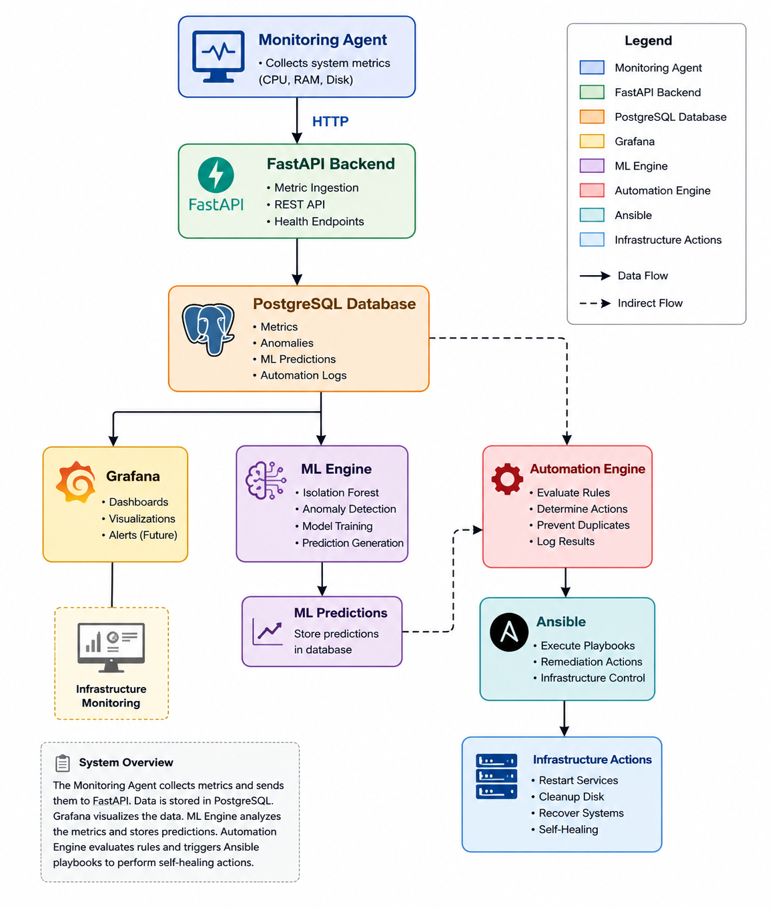
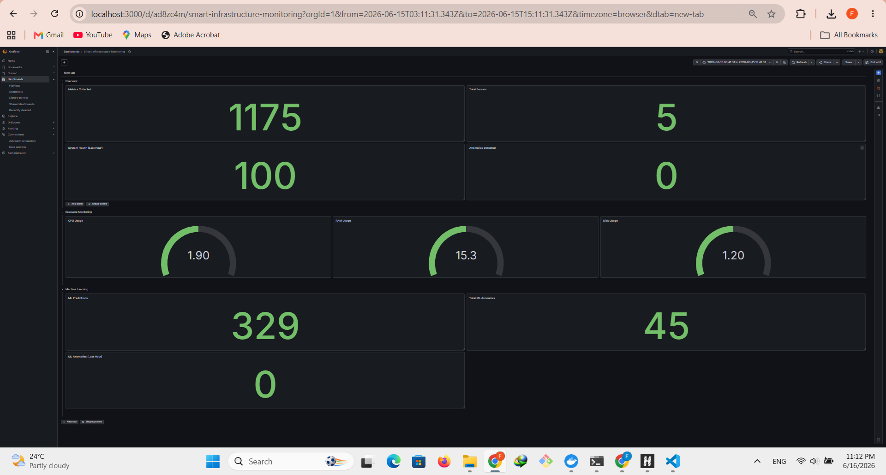

# Smart Infrastructure Platform

A self-healing infrastructure monitoring platform built with FastAPI, PostgreSQL, Grafana, Docker, Ansible, and Machine Learning.

## Overview

Smart Infrastructure Platform collects infrastructure metrics, stores them in PostgreSQL, visualizes them with Grafana, detects anomalies using Machine Learning, and automatically executes remediation actions through Ansible playbooks.

## Features

* Infrastructure monitoring with a custom Python Monitoring Agent
* FastAPI backend for metric ingestion and API access
* PostgreSQL database for persistent storage
* Grafana dashboards for real-time visualization
* Machine Learning anomaly detection using Isolation Forest
* Rule-based automation engine
* Automated infrastructure actions with Ansible
* Dockerized architecture using Docker Compose
* Automated API testing with Pytest
* Continuous Integration using GitHub Actions

## Architecture



## Grafana Dashboard



## Technology Stack

| Component        | Technology     |
| ---------------- | -------------- |
| Backend API      | FastAPI        |
| Database         | PostgreSQL     |
| Monitoring       | Python         |
| Visualization    | Grafana        |
| Machine Learning | Scikit-learn   |
| Automation       | Ansible        |
| Containerization | Docker         |
| Testing          | Pytest         |
| CI/CD            | GitHub Actions |

## Project Structure

```text
smart-infra-platform/
├── ansible/
├── automation/
├── backend/
├── database/
├── docs/
├── grafana/
├── ml-engine/
├── monitoring-agent/
├── prometheus/
├── scripts/
├── docker-compose.yml
└── README.md
```

## Automated Testing

The project includes automated API tests using Pytest.

```bash
cd backend
pytest -v
```

Example result:

```text
8 passed
```

## Continuous Integration

GitHub Actions automatically runs all backend tests on every push and pull request.

## Quick Start

```bash
git clone https://github.com/faridzmn78-gif/smart-infra-platform.git

cd smart-infra-platform

docker compose up -d
```

Backend:

```text
http://localhost:8000
```

Grafana:

```text
http://localhost:3000
```

## Future Improvements

* Kubernetes deployment
* Advanced alerting and notifications
* Multi-server monitoring
* Predictive maintenance models

## Author

Farid Zamani

GitHub:
https://github.com/faridzmn78-gif
